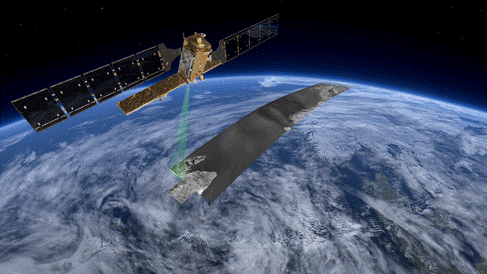
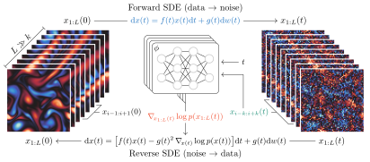
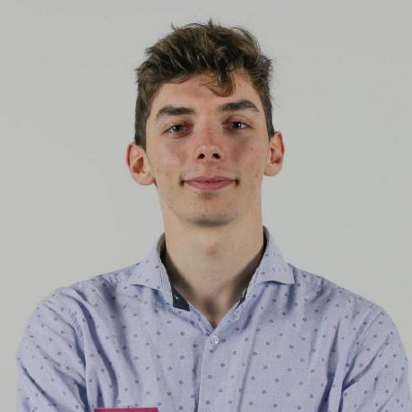

class: middle, center, title-slide

# Les modèles de diffusion et leurs applications scientifiques

Café numérique 
3 mars 2025

 

.grid[
.kol-1-3[
.width-60.circle[]
]
.kol-2-3[

 
Gilles Louppe 
[g.louppe@uliege.be](mailto:g.louppe@uliege.be)

]
]

---

class: black-slide, middle

.width-100[]

.center[Ces images sont-elles réelles ou générées par une IA?]

.footnote[Source: [black forest labs](https://blackforestlabs.ai), 2024.]

---

class: middle

.center[
.width-100[]

Un .bold[modèle de diffusion] est un processus stochastique $x\_t$ qui détériore progressivement un signal $x$ en lui ajoutant du bruit.

]

.footnote[Credits: [Song](https://yang-song.net/blog/2021/score/), 2021.]

---

class: middle

.center[
.width-100[]

En simulant le processus de .bold[diffusion à l'envers], on peut  retirer progressivement le bruit et retrouver un signal $x$.
]

.footnote[Credits: [Song](https://yang-song.net/blog/2021/score/), 2021.]

---

class: middle

.center[
.width-100[]

Mathématiquement, la diffusion inverse peut s'approximer par un .bold[réseau de neurones] $d\_\theta(x\_t, t)$ entraîné à retirer le bruit d'un signal perturbé $x\_t$.
]

---

class: middle, center

.center.width-10[]

La génération par diffusion inverse peut être télécommandée par  un signal auxiliaire $y$ pour produire des données conditionnelles.

---

class: middle

.center.width-100[]

.center[Text-to-image generation ($x$ = image, $y$ = texte)]

.footnote[Source: [stability.ai](https://stability.ai/stable-image), 2024.]

---

class: middle

.center[

<video  width="100%" controls autoplay muted>
     <source src="./figures/super-resolution.m4v" type="video/mp4">
</video>

]

.center[Image-to-image generation ($x$ = image, $y$ = image)]

.footnote[Credits: [Saharia et al](https://arxiv.org/abs/2104.07636), 2021.]

---

class: middle

.center[
    <video width="90%" controls autoplay muted>
        <source src="figures/sora.webm" type="video/mp4">
    </video>
]

.center[Text-to-video generation ($x$ = video, $y$ = texte)]

.footnote[Source: [OpenAI](https://openai.com/sora/), 2024.]

---

background-image: url(figures/controverse.png)
background-size: contain

.center[L'IA générative, un réel progrès?]

---

class: middle

.center.width-10[]

.center[L'IA est capable de résoudre des problèmes mathématiques  que personne ne peut résoudre.]

---

class: middle, black-slide, center
background-image: url(figures/y.png)
background-size: cover

.bold.larger[D'observations bruitées $y$...]

---

class: middle, black-slide, center
background-image: url(figures/x.png)
background-size: cover

.bold.larger[... peut-on reconstruire  un signal $x$?]

---

class: middle

.width-90[]

---

background-image: url(./figures/weather-forecast.png)
background-size: cover
class: middle, center

---

class: middle

.center.width-80[]

---

class: middle

.grid[
.kol-1-2[

      

.bold[Gencast] (Google Deepmind) est un modèle de diffusion pour la prévision météorologique de type image-to-image.

]
.kol-1-2[
.center.width-100[]
]
]

---

class: middle, center, black-slide

.center.width-100[]

Comment les conditions initiales $x\_0$ sont-elles connues?  Seules des observations partielles $y$ sont disponibles!

---

class: middle

.center.width-100[]

L'estimation de trajectoires plausibles $x\_{1:L}$ à partir d'observations bruitées $y$ est un problème d'.bold[assimilation de données].

---

class: middle

.avatars[]

.center.width-100[]

Notre approche (SDA):
- Construire un modèle de diffusion pour générer des trajectoires $x\_{1:L}$.
- Conditionner la génération à des observations bruitées $y$.

---

class: middle

.avatars[]

.center.width-100[]

.center[Exemple de trajectoires $x\_{1:L}$ générées à partir d'observations bruitées $y$.]

---

class: middle
count: false

.avatars[]

.center.width-100[]

.center[Exemple de trajectoires $x\_{1:L}$ générées à partir d'observations bruitées $y$.]

---

class: middle

.center.width-75[]

.center[SDA peut assimiler des observations météorologiques bruitées  pour produire des ensembles stochastiques.]

.footnote[Credits: [Manshausen et al](https://arxiv.org/abs/2406.16947), 2024.]

---

class: middle, black-slide

.avatars[]

.center.width-40[]

À l'échelle de la Terre (pour une résolution de 0.25°), .bold[une trajectoire $x\_{1:L}$ contient des milliards de variables].

Notre approche (en cours): Un .bold[video diffusion model] produisant des trajectoires $z\_{1:L}$ .bold[dans un espace latent] et décodées vers l'espace original.

---

class: middle, center, black-slide

.width-24[] .width-24[] .width-24[] .width-24[] 
.width-24[] .width-24[] .width-24[] .width-24[]
.width-24[] .width-24[] .width-24[] .width-24[]
.width-24[] .width-24[] .width-24[] .width-24[]
.width-24[] .width-24[] .width-24[] .width-24[]
.width-24[] .width-24[] .width-24[] .width-24[]

---

class: middle

.center.width-10[]

## Conclusions

- Les modèles de diffusion sont plus que des générateurs d'images.
- Ils sont un nouvel outil pour traiter des problèmes inverses de haute dimension en science.

---

class: middle

.center[

Un travail d'équipe: Merci à Gérome, François, Victor,  Omer, Sacha, Matthias et Elise!

.width-20.circle[] .width-20.circle[] .width-20.circle[] .width-20.circle[] .width-20.circle[] .width-20.circle[] .width-20.circle[]

]
